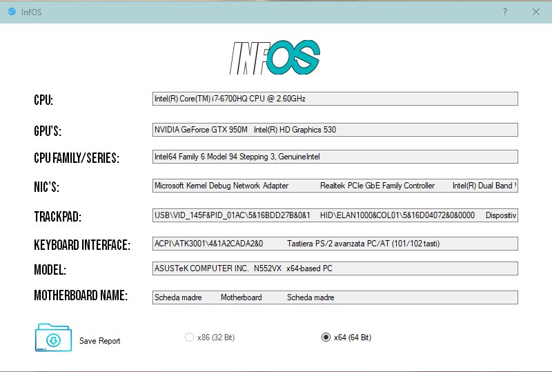

# InfOS
A Simple Hackintosh-er Tool with modern graphics,useful to check your pc's specs necessary to choose which kexts download and configure.

The infos displayed by my software are entirely based on the OEM-Written ones, my code only shows them in a more clear and simple way.

## .NET Framework 4.7.2 or higher required
You can then download the executable from the file section.

# Simply run it and see what your specs are.
>
